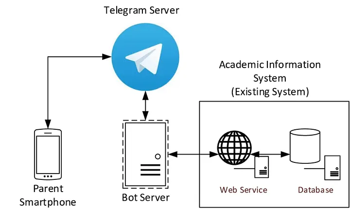
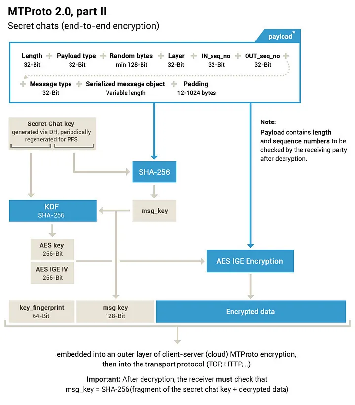
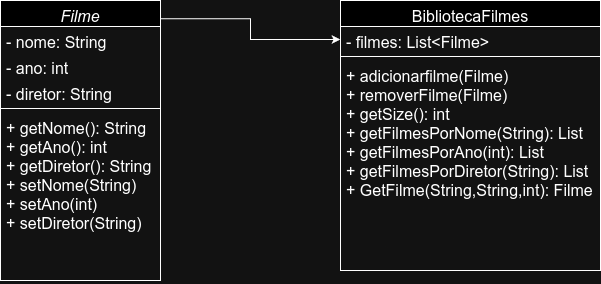

# trecho 1
We see three critical differences between programming and software engineering: time, scale, and the trade-offs at play. On a software engineering project, engineers need to be more concerned with the passage of time and the eventual need for change. In a software engineering organization, we need to be more concerned about scale and efficiency, both for the software we produce as well as for the organization that is producing it. Finally, as software engineers, we are asked to make more complex decisions with higher-stakes outcomes, often based on imprecise estimates of time and growth.
## comentário
Engenharia de software difere de programação em sua visão mais abrangete, que vai desde a preocupação com escala e tempo até a consideração da empresa que está desenvolvendo o software, além de uma visão mais estratégica de como esses aspectos se organizam e se relacionam.

# trecho 2
Within Google, we sometimes say, “Software engineering is programming integrated over time.” Programming is certainly a significant part of software engineering: after all, programming is how you generate new software in the first place. If you accept this distinction, it also becomes clear that we might need to delineate between programming tasks (development) and software engineering tasks (development, modification, maintenance). The addition of time adds an important new dimension to programming. Cubes aren’t squares, distance isn’t velocity. Software engineering isn’t programming.
## comentário
Engenharia de software como uma integral de programação no tempo. Ou seja, um somatório de pequenas partes de código em um dado espaço de tempo. Em engenharia, não se deve considerar a programação em isolado, mas em um contexto multidimensional de componentes

# Trade-offs: Java vs Python
### Desempenho
Python oferece uma sintaxe mais simples e é amplamente utilizado em desenvolvimento rápido. Em situações onde o tempo de resposta não é crítico, Python pode ser uma escolha preferida por sua facilidade de uso. Contudo, Java geralmente oferece um desempenho superior em termos de tempo de resposta e eficiência, especialmente em aplicações que exigem alta performance, como processamento intensivo de dados ou sistemas de tempo real.
### Confiabilidade
A tipagem dinâmica de Python oferece flexibilidade, mas pode introduzir maior risco de erros que só se manifestam em tempo de execução, impactando a confiabilidade. Esse trade-off é relevante em aplicações onde a detecção precoce de erros é fundamental. Por outro lado, a tipagem estática e a verificação em tempo de compilação tornam o código Java mais confiável em ambientes críticos, pois erros de tipo são identificados antes da execução. Isso é particularmente importante em sistemas que não podem abrir mão de robustez e minimização de erros em produção.
### Escalabilidade
Em escala, Python pode enfrentar desafios de desempenho devido à sua menor eficiência em multithreading e ao interpretador Global Interpreter Lock (GIL). Enquanto isso, Java é amplamente utilizado em sistemas de grande escala devido à sua capacidade de lidar eficientemente com múltiplas threads e a facilidade de gerenciar grandes volumes de dados.

# Trade-offs: SQL vs NoSQL
###  Consistência vs. Escalabilidade:
SQL oferece forte consistência e integridade de dados com o modelo ACID, mas é limitado em escalabilidade horizontal. NoSQL escala horizontalmente de forma eficiente, mas pode adotar consistência eventual, o que nem sempre é adequado para todas as aplicações.
### Estrutura de Dados Rígida vs. Flexível:
SQL utiliza esquemas rígidos que garantem a integridade dos dados, mas são menos adaptáveis a mudanças. NoSQL oferece esquemas flexíveis, ideais para dados variados e em evolução, mas com desafios na manutenção da integridade.
### Suporte a Consultas Complexas vs. Simplicidade de Consultas:
SQL suporta consultas complexas e detalhadas, mas pode ser menos eficiente em performance com grandes volumes de dados. NoSQL otimiza operações básicas para alta performance, mas torna consultas complexas mais difíceis e menos eficientes.
### Amadurecimento Tecnológico vs. Inovação:
SQL é uma tecnologia madura com padrões bem estabelecidos, ideal para ambientes empresariais. NoSQL é mais inovador e flexível, mas pode ter menos padrões e maturidade, aumentando o risco em alguns contextos.

# Trade-offs: Windows vs Linux
### Facilidade de Uso vs. Personalização:
Windows é fácil de usar e ideal para iniciantes, com uma interface intuitiva e consistente. Em contrapartida, oferece menos opções de personalização. Linux permite ampla personalização do sistema, mas pode ser mais desafiador para quem está começando.
### Compatibilidade de Software vs. Controle de Sistema:
Windows oferece ampla compatibilidade com softwares, jogos e drivers, sendo a escolha padrão para muitos usuários. No entanto, limita o controle que o usuário tem sobre o sistema. Linux proporciona maior controle e configuração do sistema, mas pode ter menos suporte para software proprietário.
### Custo vs. Suporte Comercial:
Windows é um sistema pago, com suporte comercial robusto e atualizações automáticas. Linux é geralmente gratuito e de código aberto, mas o suporte comercial pode ser limitado, exceto em distribuições empresariais.
### Segurança vs. Familiaridade:
Windows, sendo popular, é um alvo maior para malwares, mas é familiar para a maioria dos usuários. Linux é mais seguro e menos vulnerável a ataques, mas pode exigir adaptação para usuários que vêm de Windows.


# Tradeoffs de arquitetura: Telegram
O Telegram, uma das plataformas de mensagens mais populares globalmente, utiliza uma arquitetura de software sofisticada que suporta milhões de usuários simultâneos, oferecendo rapidez, segurança e escalabilidade. Abaixo, está uma descrição da arquitetura de software do Telegram e uma análise dos trade-offs associados.

## Arquitetura Distribuída com Servidores de Camada Múltipla:
- Servidores de Front-End (DCs - Data Centers): O Telegram utiliza uma arquitetura distribuída, onde os servidores de front-end são responsáveis por lidar com conexões de clientes e servir como intermediários para o roteamento de mensagens.
- Servidores de Back-End: Estes são usados para processamento e armazenamento de dados. Eles gerenciam a lógica de negócios, autenticação de usuários, e execução de comandos dos bots.
- Canais de Comunicação Segura: Os servidores do Telegram utilizam MTProto (Mobile Telegram Protocol), que é uma combinação de criptografia de ponta a ponta e criptografia cliente-servidor para proteger as comunicações.
## Camadas de Serviço:
- Camada de Aplicação: Inclui a interface do usuário (clientes do Telegram em Android, iOS, desktop, web) e a lógica da aplicação.
- Camada de Serviço: Implementa lógica de negócios e processamento de mensagens, incluindo APIs REST e a camada de bot do Telegram.
- Camada de Dados: Responsável pelo armazenamento de mensagens, arquivos, configurações de usuários, e outros metadados, geralmente usando bancos de dados distribuídos e escaláveis.
## MTProto - Protocolo de Comunicação:
- Segurança e Velocidade: MTProto é projetado para fornecer alta segurança e desempenho rápido, especialmente em redes móveis de baixa qualidade. Ele combina criptografia simétrica (AES) e assimétrica (RSA) para autenticar conexões e criptografar dados.
- Compressão: Os dados são comprimidos antes de serem enviados para melhorar a velocidade de transmissão.
## Armazenamento Distribuído e Cloud:
- Armazenamento na Nuvem: As mensagens e arquivos dos usuários são armazenados na nuvem do Telegram, permitindo o acesso de múltiplos dispositivos e garantindo backup e recuperação de dados.
- Sharding: Para gerenciar o grande volume de dados e manter o desempenho, o Telegram utiliza sharding, dividindo o armazenamento entre diferentes servidores e locais geográficos.
## Arquitetura Orientada a Eventos:
- Eventos Assíncronos: A arquitetura do Telegram é orientada a eventos, o que significa que as ações dos usuários e eventos do sistema são processados de maneira assíncrona para maximizar a eficiência e capacidade de resposta.

## Trade-offs da Arquitetura do Telegram
### Escalabilidade vs. Complexidade:
- Escalabilidade: A arquitetura distribuída permite que o Telegram escale horizontalmente para suportar milhões de usuários simultaneamente. O uso de sharding e servidores distribuídos evita sobrecargas em servidores específicos.
- Complexidade: Manter uma infraestrutura distribuída e garantir a consistência de dados em múltiplos data centers é complexo. Requer monitoramento constante, balanceamento de carga e políticas de failover para garantir disponibilidade e integridade.

### Segurança vs. Desempenho:

- Segurança: O uso do protocolo MTProto e criptografia ponta a ponta garante que as comunicações sejam seguras e resistentes a interceptações. Isso é crítico para proteger a privacidade dos usuários.
- Desempenho: Embora a segurança seja uma prioridade, o MTProto é projetado para ser leve e rápido. No entanto, há um trade-off entre a complexidade da criptografia e a latência, especialmente em redes de baixa qualidade.

### Armazenamento em Nuvem vs. Privacidade do Usuário:
- Armazenamento na Nuvem: Oferece conveniência aos usuários, permitindo sincronização entre dispositivos e backup fácil. Também melhora a resiliência do serviço.
- Privacidade do Usuário: Apesar de criptografar os dados, o fato de os dados serem armazenados nos servidores do Telegram levanta preocupações sobre privacidade e controle de dados. Usuários precisam confiar que o Telegram manterá seus dados seguros e não os acessará sem autorização.

### Desempenho vs. Custos Operacionais:
- Desempenho: Para garantir uma experiência rápida e responsiva, o Telegram investe em infraestrutura robusta e geograficamente distribuída, garantindo baixa latência.
- Custos Operacionais: Manter uma infraestrutura global, com servidores de alta capacidade e tecnologia de ponta, implica em custos operacionais elevados. Isso é especialmente relevante para o Telegram, que se orgulha de não depender de anúncios para financiar suas operações.

### Orientação a Eventos vs. Debugging e Monitoramento:
- Orientação a Eventos: Torna o sistema mais responsivo e eficiente, pois processa eventos de forma assíncrona.
- Debugging e Monitoramento: A arquitetura orientada a eventos pode tornar o rastreamento de bugs mais complexo, já que o fluxo de execução não é linear. Requer ferramentas avançadas de monitoramento e logging para rastrear problemas.

### Considerações Finais
A arquitetura de software do Telegram foi cuidadosamente projetada para suportar um grande número de usuários simultâneos, fornecer uma experiência de usuário rápida e responsiva, e garantir a segurança das comunicações. No entanto, a escolha dessa arquitetura envolve trade-offs significativos, especialmente em termos de complexidade, custos operacionais e considerações de privacidade. Para qualquer empresa considerando uma arquitetura semelhante, é fundamental pesar esses fatores com base nos objetivos de negócios e nas expectativas dos usuários.


# Classes Filme e BibliotecaFilmes
<!--  -->


## classe: Filme
<!-- ### Atributos:
 - \- nome: String
 - \- ano: int
 - \- diretor: String
### Métodos:
 - \+ getNome(): String
 - \+ getAno(): int
 - \+ getDiretor(): String
 - \+ setNome(String)
 - \+ setAno(int)
 - \+ setDiretor(String) -->

```java
    public class Filme{
        private String nome;
        private int ano;
        private String diretor;

        public String getNome(){
            return this.nome;
        }

        public int getAno(){
            return this.ano;
        }

        public String getDiretor(){
            return this.diretor;
        }

        public void setNome(String nomeFilme){
            this.nome = nomeFilme;
        }

        public void setAno(int anoFilme){
            this.ano = anoFilme;
        }

        public void setDiretor(String diretorNome){
            this.diretor = diretorNome;
        }
    }
```
## classe: BibliotecaFilmes
<!-- ### atributos:
 - \- Filmes: List
### métodos:
 - \+ adicionarFilme(Filme)
 - \+ removerFilme(Filme)
 - \+ getSize(): int
 - \+ getFilmesPorNome(String): List
 - \+ getFilmesPorAno(int): List
 - \+ getFilmesPorDiretor(String): List
 - \+ getFilme(String, String, int): Filme -->

```java
import java.util.LinkedList;
import java.util.List;

public class BibliotecaFilmes{
    private List<Filme> filmes = new LinkedList<>();

    public void adicionarFilme(Filme filme){
        this.filmes.add(filme);
    }

    public void reomverFilme (Filme filme){
        this.filmes.remove(filme);
    }

    public List<Filme> getFilmesPorNome(String nome){
        List<Filme> encontrados = new LinkedList<>(); 
        for (Filme f : this.filmes){
            if (f.getNome().equals(nome)){
                encontrados.add(f);
            }
        }
        return encontrados;
    }

    public List<Filme> getFilmesPorAno(int ano){
        List<Filme> encontrados = new LinkedList<>();
        for (Filme f : this.filmes){
            if (f.getAno() == ano){
                encontrados.add(f);
            }
        }
        return encontrados;
    }

    public List<Filme> getFilmesPorDiretor(String diretor){
        List<Filme> encontrados = new LinkedList<>();
        for (Filme f : this.filmes){
            if (f.getDiretor().equals(diretor)){
                encontrados.add(f);
            }
        }
        return encontrados;
    }

    public Filme getFilme(String nome, String diretor, int ano){
        for (Filme f : this.filmes){
            if (f.getNome().equals(nome) && f.getAno()==ano && f.getDiretor().equals(diretor)){
                return f;
            }
        }
        return null;
    }
}
```