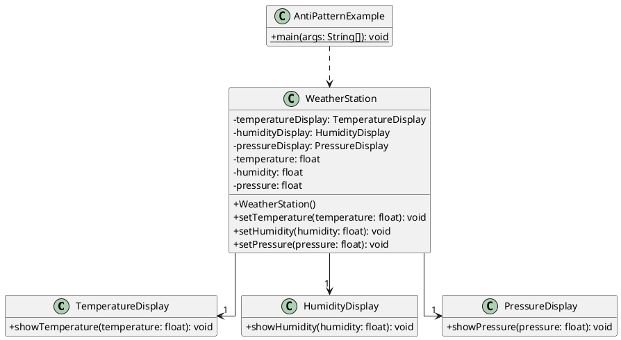
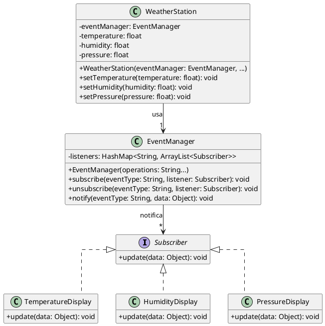

# Observer

## Anti-pattern

```puml

  @startuml
  ' Define a aparência (opcional)
  skinparam classAttributeIconSize 0
  skinparam defaultFontName "Segoe UI"
  skinparam linetype ortho
  hide empty members

  ' Classes de Display (sem interface comum)
  class TemperatureDisplay {
    + showTemperature(temperature: float): void
  }

  class HumidityDisplay {
    + showHumidity(humidity: float): void
  }

  class PressureDisplay {
    + showPressure(pressure: float): void
  }

  ' Classe principal que "controla" tudo
  class WeatherStation {
    - temperatureDisplay: TemperatureDisplay
    - humidityDisplay: HumidityDisplay
    - pressureDisplay: PressureDisplay
    - temperature: float
    - humidity: float
    - pressure: float
    + WeatherStation()
    + setTemperature(temperature: float): void
    + setHumidity(humidity: float): void
    + setPressure(pressure: float): void
  }

  ' Classe de execução (Cliente)
  class AntiPatternExample {
    + {static} main(args: String[]): void
  }

  ' --- Relações ---

  ' WeatherStation CRIA e POSSUI as instâncias de Display.
  ' Isso é Composição (losango preenchido).
  WeatherStation --> "1" TemperatureDisplay
  WeatherStation --> "1" HumidityDisplay
  WeatherStation --> "1" PressureDisplay

  ' O cliente (AntiPatternExample) depende da WeatherStation.
  AntiPatternExample ..> WeatherStation

  @enduml
```

## Pattern

```puml

@startuml
' --- Configurações de Aparência ---
skinparam classAttributeIconSize 0
skinparam defaultFontName "Segoe UI"
skinparam linetype ortho
hide empty members

' --- Componentes do Padrão ---

' Interface (Observer)
interface Subscriber {
  + update(data: Object): void
}

' Classes Concretas (Concrete Observers)
class TemperatureDisplay {
  + update(data: Object): void
}
class HumidityDisplay {
  + update(data: Object): void
}
class PressureDisplay {
  + update(data: Object): void
}

' Relação de Implementação
Subscriber <|.. TemperatureDisplay
Subscriber <|.. HumidityDisplay
Subscriber <|.. PressureDisplay


' Classe "Publisher" / "Event Channel" (O Mediador)
class EventManager {
  - listeners: HashMap<String, ArrayList<Subscriber>>
  + EventManager(operations: String...)
  + subscribe(eventType: String, listener: Subscriber): void
  + unsubscribe(eventType: String, listener: Subscriber): void
  + notify(eventType: String, data: Object): void
}

' Classe que "tem" o estado (O "Sujeito" dos dados)
class WeatherStation {
  - eventManager: EventManager
  - temperature: float
  - humidity: float
  - pressure: float
  + WeatherStation(eventManager: EventManager, ...)
  + setTemperature(temperature: float): void
  + setHumidity(humidity: float): void
  + setPressure(pressure: float): void
}

' --- Relações Principais ---

' 1. EventManager "conhece" seus Subscribers.
'    (Relação de Associação Direcionada)
EventManager --> "*" Subscriber : "notifica"

' 2. WeatherStation "conhece" o EventManager para delegar a notificação.
'    (Relação de Associação Direcionada)
WeatherStation --> "1" EventManager : "usa"

@enduml
```

