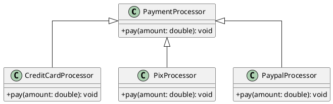
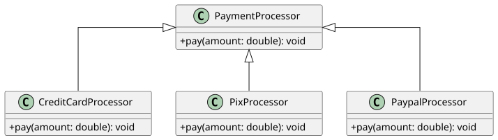
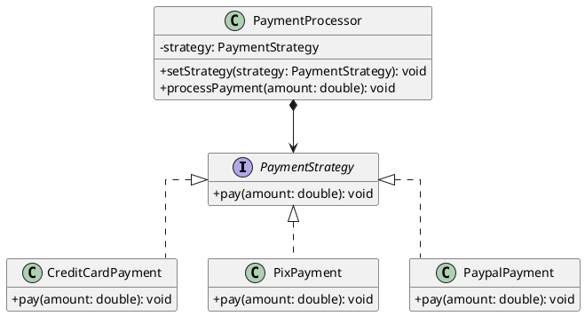
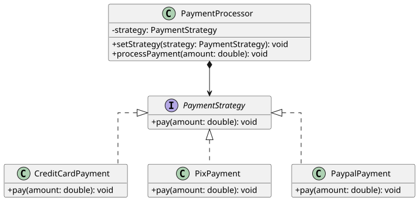

# Strategy

## Anti-pattern

```puml
@startuml
' --- Configurações de Aparência ---
skinparam classAttributeIconSize 0
skinparam defaultFontName "Segoe UI"
skinparam linetype ortho

' --- Estrutura de Herança ---

' Superclasse (Generalização)
class PaymentProcessor {
  + pay(amount: double): void
}

' Subclasses (Especializações)
class CreditCardProcessor {
  + pay(amount: double): void
}

class PixProcessor {
  + pay(amount: double): void
}

class PaypalProcessor {
  + pay(amount: double): void
}

' Relação de Herança
' (A seta aponta da subclasse para a superclasse)
PaymentProcessor <|-- CreditCardProcessor
PaymentProcessor <|-- PixProcessor
PaymentProcessor <|-- PaypalProcessor

@enduml
```

## Pattern

```puml
@startuml
' --- Configurações de Aparência ---
skinparam classAttributeIconSize 0
skinparam defaultFontName "Segoe UI"
skinparam linetype ortho
hide empty members

' --- Componentes do Padrão Strategy ---

' A interface (Strategy)
interface PaymentStrategy {
  + pay(amount: double): void
}

' As implementações concretas (Concrete Strategies)
class CreditCardPayment {
  + pay(amount: double): void
}
class PixPayment {
  + pay(amount: double): void
}
class PaypalPayment {
  + pay(amount: double): void
}

' Relação de Implementação
PaymentStrategy <|.. CreditCardPayment
PaymentStrategy <|.. PixPayment
PaymentStrategy <|.. PaypalPayment

' A classe de Contexto
class PaymentProcessor {
  - strategy: PaymentStrategy
  + setStrategy(strategy: PaymentStrategy): void
  + processPayment(amount: double): void
}

' --- Relação Principal (Composição/Agregação) ---

' PaymentProcessor "tem-uma" PaymentStrategy.
' Esta é a relação de Agregação.
PaymentProcessor *--> PaymentStrategy

@enduml
```

